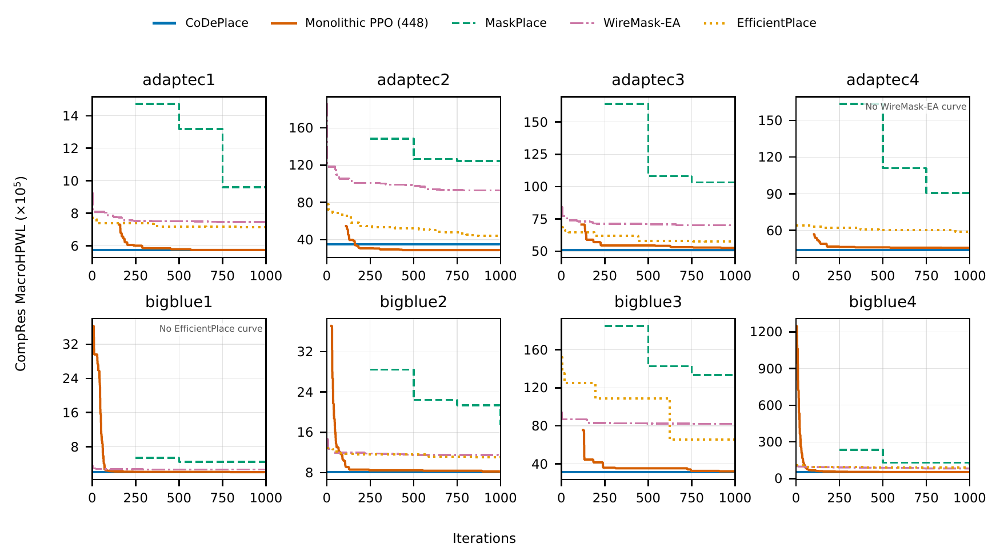
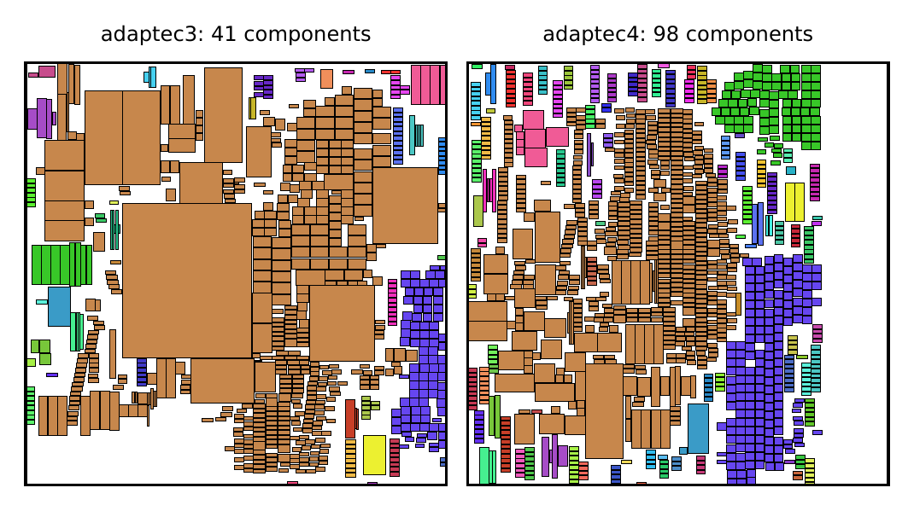
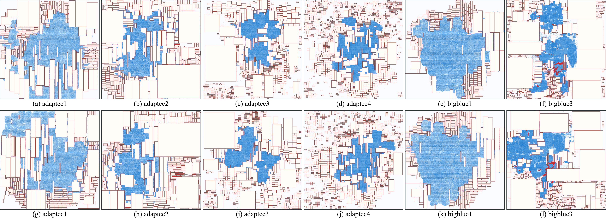
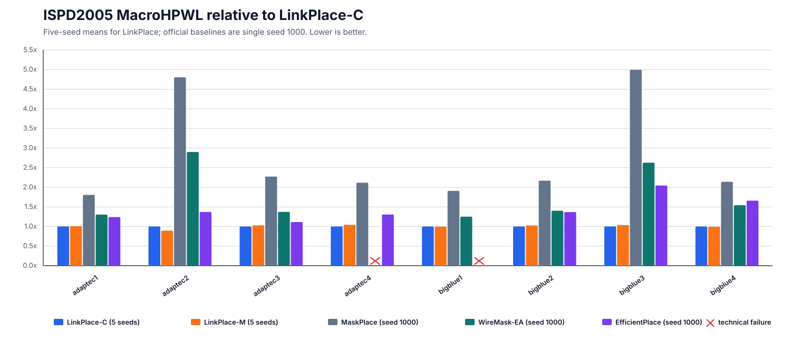
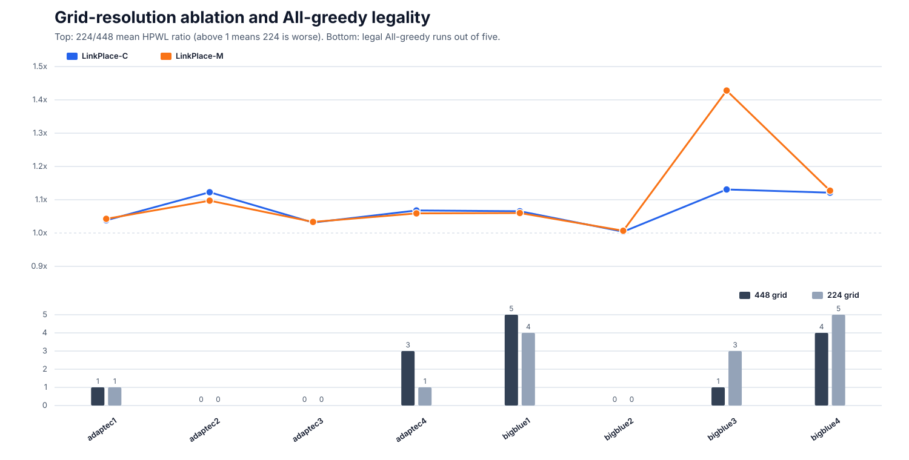
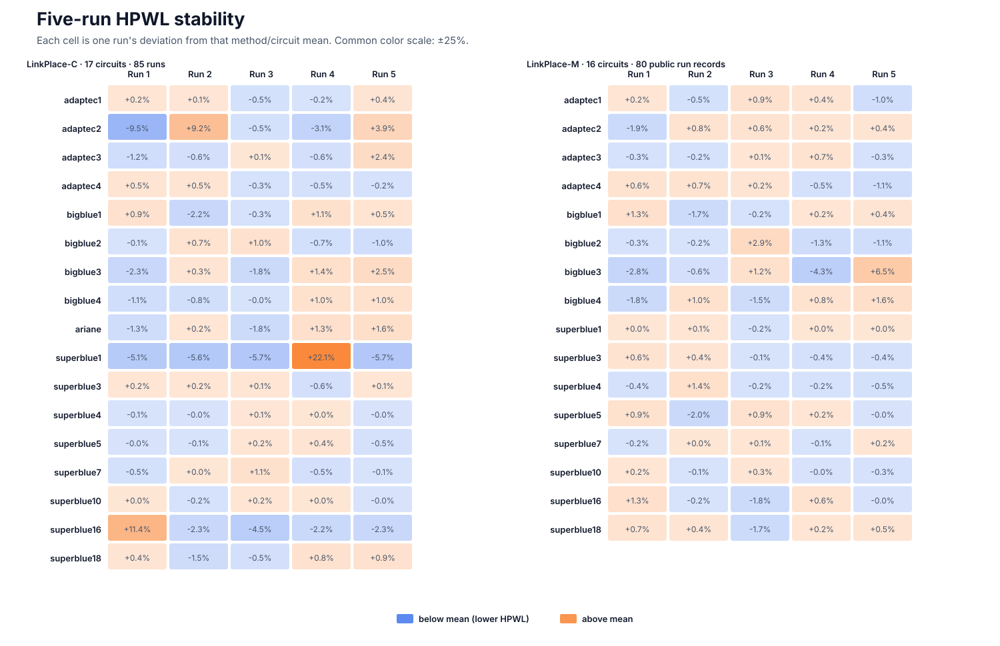
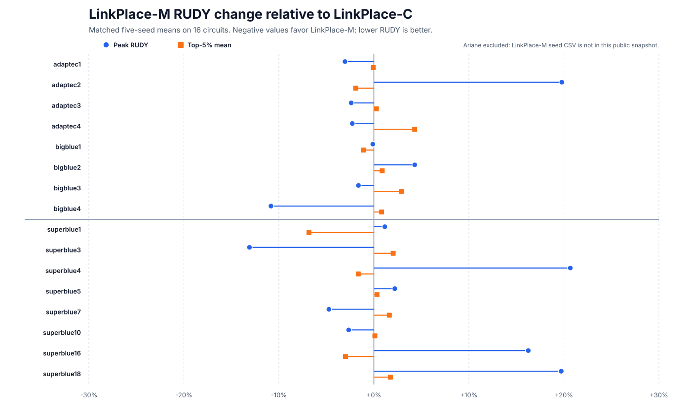

# LinkPlace

LinkPlace is the reproducibility release for connectivity-aware macro
placement. The release uses two public method names:

- **LinkPlace-C** (`linkplace-c`): decomposes the macro netlist into connected
  components and trains/places large components sequentially.
- **LinkPlace-M** (`linkplace-m`): trains one monolithic PPO policy over the
  same selected macros and ordering rules.

The code in this directory is a clean publication staging tree. It does not
contain private server paths, raw benchmarks, trained checkpoints, or the full
18 GB experiment archive.

## Repository layout

```text
linkplace/              Core method, models, evaluator, and CLI
tools/                  Queue, aggregation, dataset-import, and QA utilities
tests/                  Unit and PPO-equivalence tests
configs/                Machine-readable formal protocol
docs/                   Protocol, dataset, and reproduction notes
artifacts/tables/       Small paper-facing CSV/JSON artifacts only
environment/            Environment reconstruction notes and lock-file slots
```

## Installation

Create a clean Python environment and install the package in editable mode:

```bash
python -m venv .venv
source .venv/bin/activate
python -m pip install --upgrade pip
python -m pip install -e ".[test]"
```

Install a CUDA-enabled PyTorch build that matches your driver before running
formal GPU experiments. Exact server package exports, when available, belong
under `environment/` and take precedence over the broad development bounds in
`pyproject.toml`.

## Quick checks

```bash
python -m unittest discover -s tests -v
python -m linkplace.runner --help
```

After preparing benchmark caches (see `docs/DATASETS.md`):

```bash
python -m linkplace.runner --cache-root datasets/cache inspect adaptec1
```

<!-- README_RESULTS:BEGIN -->
## Results reported in the paper

The paper calls the two variants **CoDePlace** and **Monolithic PPO**; this public release uses **LinkPlace-C** and **LinkPlace-M**, respectively. The tables below reproduce the manuscript results first. Published-reference rows retain the precision reported by their cited papers, while LinkPlace rows are five-seed results from seeds `999–1003`. Lower HPWL and RUDY are better, and `±` denotes sample standard deviation.

### ISPD2005 MacroHPWL

Six circuits use the complete macro set. Values are CompRes MacroHPWL scaled by `1e5`; LinkPlace cells also include mean runtime.

| Method | adaptec1 | adaptec2 | adaptec3 | adaptec4 | bigblue1 | bigblue3 |
|---|---:|---:|---:|---:|---:|---:|
| GraphPlace | 30.10 ± 2.98 | 351.71 ± 38.20 | 358.18 ± 13.95 | 151.42 ± 9.72 | 10.58 ± 1.29 | 357.48 ± 47.83 |
| DeepPR | 19.91 ± 2.13 | 203.51 ± 6.27 | 347.16 ± 4.32 | 311.86 ± 56.74 | 23.33 ± 3.65 | 430.48 ± 12.18 |
| MaskPlace (3k) | 7.62 ± 0.67 | 75.16 ± 4.97 | 100.24 ± 13.54 | 87.99 ± 3.25 | 3.04 ± 0.06 | 90.04 ± 4.83 |
| Chipformer (2k) | 6.62 ± 0.05 | 67.10 ± 5.46 | 76.70 ± 1.15 | 68.80 ± 1.59 | 2.95 ± 0.04 | 72.92 ± 2.56 |
| WireMask-EA (1k) | 6.15 ± 0.05 | 64.38 ± 4.43 | 58.18 ± 1.04 | 59.52 ± 1.71 | 2.15 ± 0.01 | 59.85 ± 3.39 |
| EfficientPlace (1k) | 5.94 ± 0.04 | 46.79 ± 1.60 | 56.35 ± 0.99 | 58.47 ± 1.61 | 2.14 ± 0.01 | 58.38 ± 0.54 |
| Diffusion | 9.19 | 31.0 | 54.4 | 54.5 | 2.64 | 35.9 |
| EGPlace (1k) | 5.85 ± 0.08 | 37.39 ± 1.58 | 61.09 ± 1.00 | 55.54 ± 1.64 | 2.24 ± 0.03 | 50.89 ± 4.69 |
| EA-Rotation (2k) | 5.04 ± 0.30 | 49.72 ± 2.02 | 57.20 ± 0.99 | 56.99 ± 0.96 | 2.12 ± 0.01 | 55.43 ± 1.79 |
| **LinkPlace-M** | 5.77 ± 0.04 (2.31 h) | 28.66 ± 0.32 (2.41 h) | 52.61 ± 0.22 (3.08 h) | 45.54 ± 0.35 (5.68 h) | 2.12 ± 0.02 (2.38 h) | 32.37 ± 1.35 (5.57 h) |
| **LinkPlace-C** | 5.72 ± 0.02 (1.76 h) | 32.02 ± 2.27 (2.04 h) | 51.13 ± 0.71 (2.35 h) | 43.74 ± 0.20 (3.68 h) | 2.13 ± 0.03 (2.26 h) | 31.25 ± 0.64 (3.62 h) |

Bigblue2 and bigblue4 use the EGPlace-selected 1,024-macro subsets and are therefore reported separately.

| Method | bigblue2 | bigblue4 |
|---|---:|---:|
| MaskPlace (3k) | 18.64 ± 0.63 | 117.96 ± 5.62 |
| Chipformer (2k) | 14.06 ± 0.47 | 120.66 ± 8.03 |
| WireMask-EA (1k) | 11.35 ± 0.15 | 82.96 ± 2.32 |
| EfficientPlace (1k) | 12.20 ± 0.29 | 86.86 ± 3.41 |
| EGPlace (1k) | 11.16 ± 0.47 | 61.90 ± 2.73 |
| **LinkPlace-M** | 8.24 ± 0.14 (4.40 h) | 52.89 ± 0.83 (4.42 h) |
| **LinkPlace-C** | 8.04 ± 0.07 (3.80 h) | 53.35 ± 0.54 (3.76 h) |

### Convergence and component-aware placements

[](assets/paper/ispd2005_convergence.png)

**Paper figure — ISPD2005 convergence (seed 1000).** The x-axis is iterations. LinkPlace-C is a horizontal line at its validated final CompRes MacroHPWL; all other available curves are cumulative minima over retained legal layouts. WireMask-EA/adaptec4 and EfficientPlace/bigblue1 remain absent because their formal runs ended in preserved technical artifact failures.

[](assets/paper/linkplace_component_layouts.png)

**Paper figure — best LinkPlace-C layouts for adaptec3 and adaptec4.** Macros in the same connectivity component share a color.

### Ariane

Ariane is nearly monolithic: one component contains 931 of 932 macros. Values are MacroHPWL scaled by `1e5`.

| Method | Ariane |
|---|---:|
| MaskPlace | 14.63 |
| EfficientPlace | 12.47 |
| EGPlace | 7.91 |
| **LinkPlace-M (448)** | **7.20 ± 0.17 (4.02 h)** |
| **LinkPlace-C (448)** | 7.23 ± 0.11 (3.89 h) |

### ICCAD2015-derived macro-only instances

Values are MacroHPWL scaled by `1e8`. Published references are retained from EGPlace; LinkPlace cells include five-seed mean, sample standard deviation, and mean runtime.

| Method | superblue1 | superblue3 | superblue4 | superblue5 | superblue7 | superblue10 | superblue16 | superblue18 |
|---|---:|---:|---:|---:|---:|---:|---:|---:|
| WireMask-EA (1k) | 1.37 | 4.40 | 2.11 | 11.00 | 2.86 | 1.18 | 2.85 | 1.46 |
| EfficientPlace (1k) | 1.26 | 3.81 | 1.99 | 9.70 | 2.86 | 0.93 | 2.79 | 1.12 |
| EGPlace (1k) | 1.31 | 3.22 | 1.91 | 8.62 | 2.90 | 1.00 | 2.03 | 0.96 |
| **LinkPlace-M** | 1.037 ± 0.001 (2.16 h) | 2.613 ± 0.012 (2.16 h) | 1.551 ± 0.012 (2.17 h) | 7.258 ± 0.088 (2.18 h) | 2.427 ± 0.003 (2.17 h) | 0.887 ± 0.002 (2.16 h) | 2.046 ± 0.023 (2.19 h) | 0.840 ± 0.008 (2.15 h) |
| **LinkPlace-C** | 1.13 ± 0.14 (0.11 h) | 2.55 ± 0.01 (0.28 h) | 1.58 ± 0.00 (0.20 h) | 7.22 ± 0.02 (0.58 h) | 2.40 ± 0.02 (0.31 h) | 0.89 ± 0.00 (0.05 h) | 2.11 ± 0.14 (0.47 h) | 0.82 ± 0.01 (0.15 h) |

### RUDY: placement grid and evaluation grid

The placement grid generates every reported layout on the `448 × 448` action grid. A separate, fixed `224 × 224` evaluation grid then computes peak RUDY and the top-5% mean using the projected macro netlist. The evaluation grid does **not** alter the policy, placement order, reward, or component translation; it is an independent post-placement measurement stage.

<details open>
<summary><strong>Full five-seed RUDY table from the paper</strong></summary>

| Circuit | LinkPlace-C peak | LinkPlace-M peak | LinkPlace-C top-5% | LinkPlace-M top-5% |
|---|---:|---:|---:|---:|
| adaptec1 | 0.666249 ± 0.0757 | 0.645991 ± 0.085 | 0.0821768 ± 0.000466 | 0.0821225 ± 0.000543 |
| adaptec2 | 0.732489 ± 0.199 | 0.877377 ± 0.0749 | 0.14394 ± 0.00691 | 0.141186 ± 0.00326 |
| adaptec3 | 0.578448 ± 0.138 | 0.56465 ± 0.105 | 0.0877631 ± 0.00128 | 0.0879957 ± 0.00126 |
| adaptec4 | 0.394727 ± 0.0146 | 0.385773 ± 0.00527 | 0.0759508 ± 0.000948 | 0.0792122 ± 0.0022 |
| bigblue1 | 0.137881 ± 0.0116 | 0.137724 ± 0.0079 | 0.0307165 ± 0.000296 | 0.0303788 ± 0.000381 |
| bigblue2 | 0.0719219 ± 0.00658 | 0.0750122 ± 0.00587 | 0.0214889 ± 0.000393 | 0.0216774 ± 0.000397 |
| bigblue3 | 0.818337 ± 0.0449 | 0.80503 ± 0.0305 | 0.0746362 ± 0.00217 | 0.076791 ± 0.00293 |
| bigblue4 | 0.457117 ± 0.121 | 0.407608 ± 0.0147 | 0.0794019 ± 0.000532 | 0.0800462 ± 0.00146 |
| Ariane | 98.8939 ± 12.4 | 97.6278 ± 9.96 | 36.0242 ± 4.32 | 32.6640 ± 3.10 |
| superblue1 | 0.000231756 ± 1.37e-05 | 0.00023442 ± 9.99e-06 | 8.84153e-06 ± 8.39e-07 | 8.23751e-06 ± 7.4e-09 |
| superblue3 | 0.000551671 ± 9.56e-05 | 0.000479434 ± 0.000104 | 1.55328e-05 ± 1.35e-07 | 1.58482e-05 ± 6.69e-08 |
| superblue4 | 0.000680785 ± 0.000169 | 0.000821537 ± 0.000139 | 2.90048e-05 ± 2.23e-08 | 2.85279e-05 ± 2.09e-07 |
| superblue5 | 0.000603314 ± 7.55e-06 | 0.000616577 ± 1.99e-05 | 4.24537e-05 ± 2.42e-07 | 4.25915e-05 ± 4.98e-07 |
| superblue7 | 0.000780209 ± 6.62e-05 | 0.000743269 ± 8.44e-05 | 3.51724e-05 ± 1.98e-07 | 3.57444e-05 ± 7.61e-08 |
| superblue10 | 0.000257661 ± 9.46e-06 | 0.000250823 ± 9.04e-06 | 7.57888e-06 ± 9.62e-09 | 7.58675e-06 ± 1.76e-08 |
| superblue16 | 0.000326553 ± 2.64e-05 | 0.000379617 ± 3.41e-05 | 3.70305e-05 ± 1.94e-06 | 3.59234e-05 ± 4.39e-07 |
| superblue18 | 0.000354221 ± 6e-05 | 0.00042407 ± 2.29e-05 | 2.1565e-05 ± 1.57e-07 | 2.19391e-05 ± 1.72e-07 |

</details>

Across the 17 matched circuits, LinkPlace-M has lower mean peak RUDY on 10 circuits and LinkPlace-C on 7; for the top-5% mean, LinkPlace-C is lower on 10 and LinkPlace-M on 7. These two statistics characterize different congestion behavior and neither is a training objective.

### Controlled method and placement-grid ablation

All three variants use seeds `999–1003` on both placement grids. Every RUDY value is still computed afterward by the same independent `224 × 224` evaluation grid. Each compact cell is `HPWL ×1e5; peak RUDY; legal runs`.

<details open>
<summary><strong>Full paper ablation table</strong></summary>

| Circuit | M 448 | All-greedy 448 | C 448 | M 224 | All-greedy 224 | C 224 |
|---|---:|---:|---:|---:|---:|---:|
| adaptec1 | 5.77 ± 0.04; Rmax 0.646 ± 0.085; 5/5 | 6.20; Rmax 0.787; 1/5 | 5.72 ± 0.02; Rmax 0.666 ± 0.076; 5/5 | 6.02 ± 0.02; Rmax 0.586 ± 0.005; 5/5 | 5.97; Rmax 0.582; 1/5 | 5.94 ± 0.03; Rmax 0.586 ± 0.005; 5/5 |
| adaptec2 | 28.66 ± 0.32; Rmax 0.877 ± 0.075; 5/5 | failed (0/5) | 32.02 ± 2.27; Rmax 0.732 ± 0.199; 5/5 | 31.45 ± 1.07; Rmax 0.843 ± 0.049; 5/5 | failed (0/5) | 35.95 ± 3.20; Rmax 0.634 ± 0.076; 5/5 |
| adaptec3 | 52.61 ± 0.22; Rmax 0.565 ± 0.105; 5/5 | failed (0/5) | 51.13 ± 0.71; Rmax 0.578 ± 0.138; 5/5 | 54.37 ± 0.74; Rmax 0.623 ± 0.065; 5/5 | failed (0/5) | 52.74 ± 0.29; Rmax 0.594 ± 0.002; 5/5 |
| adaptec4 | 45.54 ± 0.35; Rmax 0.386 ± 0.005; 5/5 | 46.95 ± 0.60; Rmax 0.441 ± 0.027; 3/5 | 43.74 ± 0.20; Rmax 0.395 ± 0.015; 5/5 | 48.22 ± 0.41; Rmax 0.366 ± 0.014; 5/5 | 49.83; Rmax 0.373; 1/5 | 46.70 ± 0.37; Rmax 0.374 ± 0.004; 5/5 |
| bigblue1 | 2.12 ± 0.02; Rmax 0.138 ± 0.008; 5/5 | 2.17 ± 0.02; Rmax 0.136 ± 0.005; 5/5 | 2.13 ± 0.03; Rmax 0.138 ± 0.012; 5/5 | 2.25 ± 0.02; Rmax 0.125 ± 0.003; 5/5 | 2.30 ± 0.02; Rmax 0.147 ± 0.000; 4/5 | 2.27 ± 0.02; Rmax 0.123 ± 0.000; 5/5 |
| bigblue2 | 8.24 ± 0.14; Rmax 0.075 ± 0.006; 5/5 | failed (0/5) | 8.04 ± 0.07; Rmax 0.072 ± 0.007; 5/5 | 8.30 ± 0.08; Rmax 0.064 ± 0.004; 5/5 | failed (0/5) | 8.07 ± 0.04; Rmax 0.065 ± 0.004; 5/5 |
| bigblue3 | 32.37 ± 1.35; Rmax 0.805 ± 0.031; 5/5 | 68.24; Rmax 0.817; 1/5 | 31.25 ± 0.64; Rmax 0.818 ± 0.045; 5/5 | 46.22 ± 15.13; Rmax 0.748 ± 0.000; 5/5 | 72.79 ± 0.95; Rmax 0.748 ± 0.000; 3/5 | 35.33 ± 1.93; Rmax 0.755 ± 0.014; 5/5 |
| bigblue4 | 52.89 ± 0.83; Rmax 0.408 ± 0.015; 5/5 | 57.15 ± 3.03; Rmax 0.426 ± 0.007; 4/5 | 53.35 ± 0.54; Rmax 0.457 ± 0.121; 5/5 | 59.62 ± 1.00; Rmax 0.484 ± 0.145; 5/5 | 65.98 ± 2.98; Rmax 0.433 ± 0.041; 5/5 | 59.81 ± 0.97; Rmax 0.498 ± 0.165; 5/5 |

</details>

LinkPlace-C has lower mean HPWL than LinkPlace-M on five of eight circuits at both resolutions. All-greedy produces 14/40 legal runs per grid; all 52 failed seed-level trials are retained as failures rather than converted into artificial HPWL values.

### Best legal mixed-size placements

The table reports the best legal full-design placement obtained for each completed circuit. Values are the exact physical-coordinate MacroHPWL after DREAMPlace 4.1.0 standard-cell placement, and each archive contains the final placement and its LinkPlace macro initialization.

| Circuit | LinkPlace variant | Final full-design HPWL | Placement package |
|---|---|---:|---|
| adaptec1 | LinkPlace-C | 70,851,633 | [download](artifacts/mixed_size_best/adaptec1.zip) |
| adaptec2 | LinkPlace-C | 93,710,386 | [download](artifacts/mixed_size_best/adaptec2.zip) |
| adaptec3 | LinkPlace-C | 138,080,476 | [download](artifacts/mixed_size_best/adaptec3.zip) |
| adaptec4 | LinkPlace-C | 150,406,856 | [download](artifacts/mixed_size_best/adaptec4.zip) |
| bigblue1 | LinkPlace-M | 84,204,736 | [download](artifacts/mixed_size_best/bigblue1.zip) |
| bigblue3 | LinkPlace-C | 274,468,869 | [download](artifacts/mixed_size_best/bigblue3.zip) |

[Machine-readable summary](artifacts/mixed_size_best/summary.csv) · [SHA-256 checksums](artifacts/mixed_size_best/SHA256SUMS)

[](assets/paper/dreamplace_final_layouts.png)

**Best legal mixed-size layouts.** Panels (a)–(f) use LinkPlace-M macro initializations and panels (g)–(l) use LinkPlace-C, following the circuit order in the table.

## Additional server results not shown in the paper

The following views expose server records that are too detailed for the manuscript: exact per-seed outcomes, same-code official-baseline comparisons, stochastic stability, and additional normalized plots. They do not replace the paper tables above.

### Archived run coverage

| Result family | Public records | Protocol | Terminal outcome |
|---|---:|---|---|
| LinkPlace-C main | 85 | 17 circuits × seeds 999–1003 | 85/85 complete legal layouts |
| Dual-grid ablation | 240 | 8 ISPD2005 × 2 grids × 3 variants × 5 seeds | 188/240 legal; All-greedy failures retained |
| LinkPlace-M ICCAD2015 | 40 | 8 circuits × seeds 999–1003 | 40/40 complete legal layouts |
| Same-code official baselines | 24 | 3 methods × 8 ISPD2005 × seed 1000 | 22/24 legal; 2 technical failures retained |

### Same-code ISPD2005 comparison (seed 1000 baselines)



Exact CompRes MacroHPWL values are scaled by `1e5`. LinkPlace values are five-seed statistics; MaskPlace, WireMask-EA, and EfficientPlace are official implementations run once with seed `1000`.

| Circuit | LinkPlace-C | LinkPlace-M | Δ M vs C | MaskPlace | WireMask-EA | EfficientPlace |
|---|---:|---:|---:|---:|---:|---:|
| adaptec1 | 5.723 ± 0.021 | 5.770 ± 0.042 | +0.83% | 10.333 | 7.456 | 7.097 |
| adaptec2 | 32.025 ± 2.267 | 28.659 ± 0.316 | -10.51% | 153.845 | 92.863 | 43.918 |
| adaptec3 | 51.129 ± 0.713 | 52.614 ± 0.217 | +2.90% | 116.168 | 70.157 | 56.942 |
| adaptec4 | 43.738 ± 0.202 | 45.536 ± 0.351 | +4.11% | 92.545 | *technical failed* | 57.086 |
| bigblue1 | 2.126 ± 0.029 | 2.119 ± 0.023 | -0.33% | 4.056 | 2.659 | *technical failed* |
| bigblue2 | 8.039 ± 0.071 | 8.245 ± 0.138 | +2.56% | 17.438 | 11.271 | 10.993 |
| bigblue3 | 31.246 ± 0.642 | 32.369 ± 1.351 | +3.59% | 156.090 | 82.069 | 63.876 |
| bigblue4 | 53.347 ± 0.535 | 52.891 ± 0.828 | -0.86% | 114.111 | 82.304 | 88.510 |

### Additional ablation and seed-level visualizations





The heatmap shows every public seed's HPWL deviation from its method/circuit mean, exposing stochastic spread hidden by mean ± standard deviation.



This normalized plot compares matched LinkPlace-C/LinkPlace-M RUDY means on the 16 circuits with public seed-level records for both variants. Ariane is omitted only from this extra plot because the public snapshot currently carries its LinkPlace-M paper summary rather than its seed CSV.

### Machine-readable server records

- [LinkPlace-C: 85 per-seed records](artifacts/tables/main_seed_results.csv) and [17-circuit summary](artifacts/tables/main_mean_std.csv)
- [Dual-grid ablation: 240 per-seed records](artifacts/tables/grid_ablation_five_seed_results.csv) and [48 summary rows](artifacts/tables/grid_ablation_five_seed_mean_std.csv)
- [LinkPlace-M ICCAD2015: 40 per-seed records](artifacts/tables/linkplace_m_iccad2015_seed_results.csv) and [8-circuit summary](artifacts/tables/linkplace_m_iccad2015_mean_std.csv)
- [Official baselines: 24 seed records](artifacts/tables/baseline_seed_results.csv), including the preserved WireMask-EA/adaptec4 and EfficientPlace/bigblue1 technical failures

Regenerate and verify the generated section and SVGs with:

```bash
python tools/render_readme_results.py --write
python tools/render_readme_results.py --check
```
<!-- README_RESULTS:END -->

## Formal reproduction

The complete settings and result schema are frozen in
[`docs/FORMAL_PROTOCOL.md`](docs/FORMAL_PROTOCOL.md) and
[`configs/formal.json`](configs/formal.json). Formal runs use seeds
999-1003, 1000 episodes, and a 448 x 448 grid; the grid ablation additionally
uses 224 x 224.

Set environment variables only when paths differ from the defaults:

```bash
export LINKPLACE_PYTHON=/path/to/python
export LINKPLACE_RESULT_ROOT=/path/to/outputs/formal
```

The aggregation tools accept archived `ablation/monolithic` results as a
legacy alias but expose them as LinkPlace-M. New executions never write the old
method name.

## Paper artifacts

Only small, reviewable tables and manifests should be committed. Raw result
trees, checkpoints, TensorBoard files, datasets, and third-party build trees
are ignored. Large immutable artifacts should be published separately (for
example, an institutional repository or Zenodo) with SHA-256 manifests and a
versioned DOI.

## Publication blockers

Before making this repository public:

1. Resolve the MaskPlace-derived code identified in
   `THIRD_PARTY_NOTICES.md`. The audited MaskPlace revision has no explicit
   license, so public redistribution requires written permission or independent
   replacement code before choosing a repository-wide license.
2. Add the final author list, repository URL, paper title, and DOI to a valid
   `CITATION.cff`.
3. Verify benchmark redistribution terms; the current release intentionally
   excludes benchmark data.

No license is implied until a `LICENSE` file is added by the authors.
